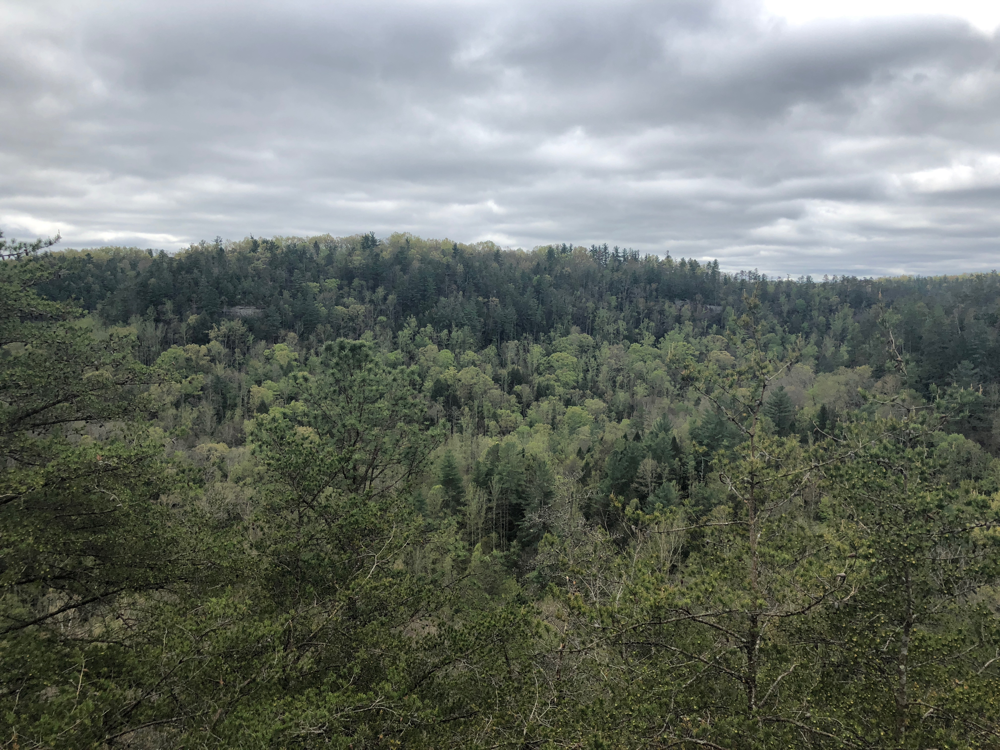

# Field Report - Sky Bridge
## Tyler Maynard
## April 21st, 2019

I chose to analyze Sky Bridge, which lies on a roughly 0.8-mile trail at Red River Gorge. It sits less than a mile beyond the parking area, past the Sky Bridge Loop Trail. After a small trek, the adventurer is greeted with a breathtaking view of forestry and nearby cliffs and arches.

From my analytics, it appears to be approx. 85ft long, about 18ft wide, and has a depth of roughly 50ft. From a birdseye view, this gives it and estimated area of about 1,530 square feet. I would say this is close to the actual dimensions of the landform.

Upper Entrance

Local Environment

Lower Entrance

Side View

Small Arch Underneath

Rear View

Click [here](https://tyjmaynard.github.io/rrg/) to visit my Red River Gorge page

<!-- title="upper_entrance"  -->
<!-- </a> -->